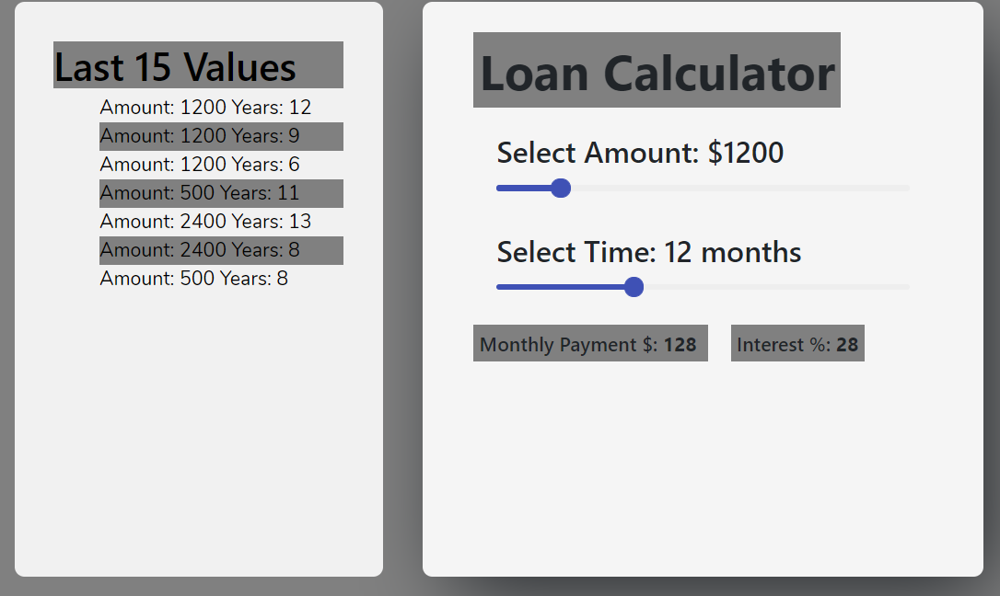
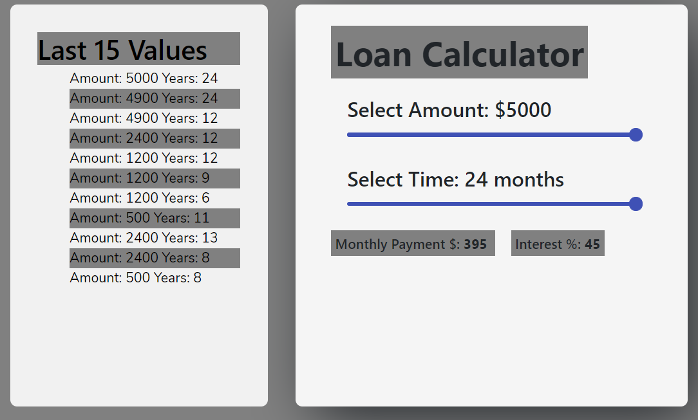
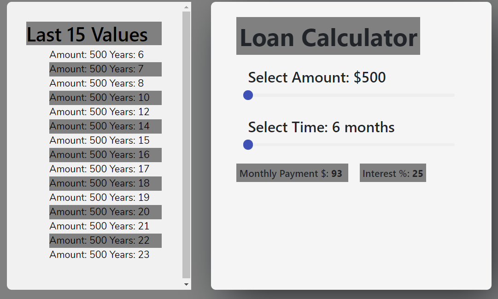

## React Loan Calculator

## Preview


# ----------------------------------------------------------

# ----------------------------------------------------------


## Installation

### Setup

```sh
git clone https://github.com/GavBaros/react-loan-calculator.git
cd react-loan-calculator
npm install
npm start
```

### Tests

```sh
npm run test
```

## Documentation

### Amount Range Slider

- A controlled component that can accept number values between 1000 and 20000
- Increases or decreases by a number value of 100 at a time ('step' prop)

### Years Range Slider

- A controlled component that can accept number values between 1 and 5
- The values indicate the amount of years rather than months
- Increases or decreases by a number value of 0.5 years at a time ('step' prop), to represent changes of 6 months at a time

