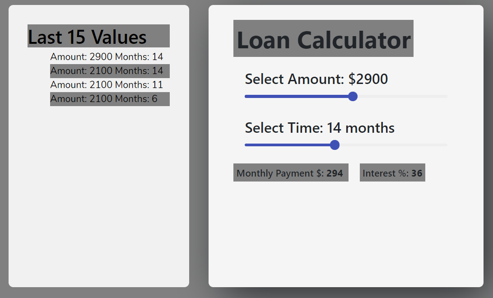
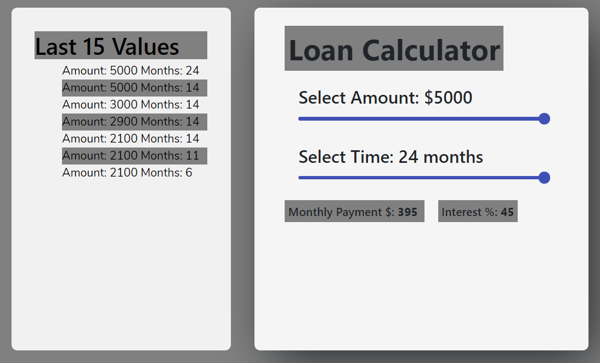
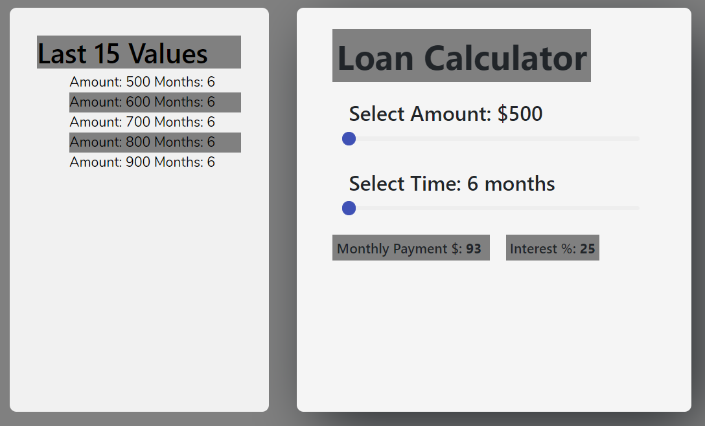

## React Loan Calculator

## Preview


# ----------------------------------------------------------

# ----------------------------------------------------------


## Installation

```sh
https://github.com/abhisingh192/react-loan-calculator.git
cd react-loan-calculator
npm install
npm start
```

## Documentation

### Amount Range Slider

- A controlled component that can accept number values between 500 and 5000
- The values indicates the amount in $
- Increases or decreases by a number value of 100 at a time ('step' prop)

### Months Range Slider

- A controlled component that can accept number values between 6  and 24 
- The values indicate the number of months
- Increases or decreases by a number value of 1 at a time

### SideBar
- Shows the latest 15 values cached in localStorage
- On clicking on any value of sidebar, amount and the months gets updated and the corresponding values of interest rate and monthly payment are   fetched from the API

### Monthly Payment and Interest Rate values are fetched from the API 


